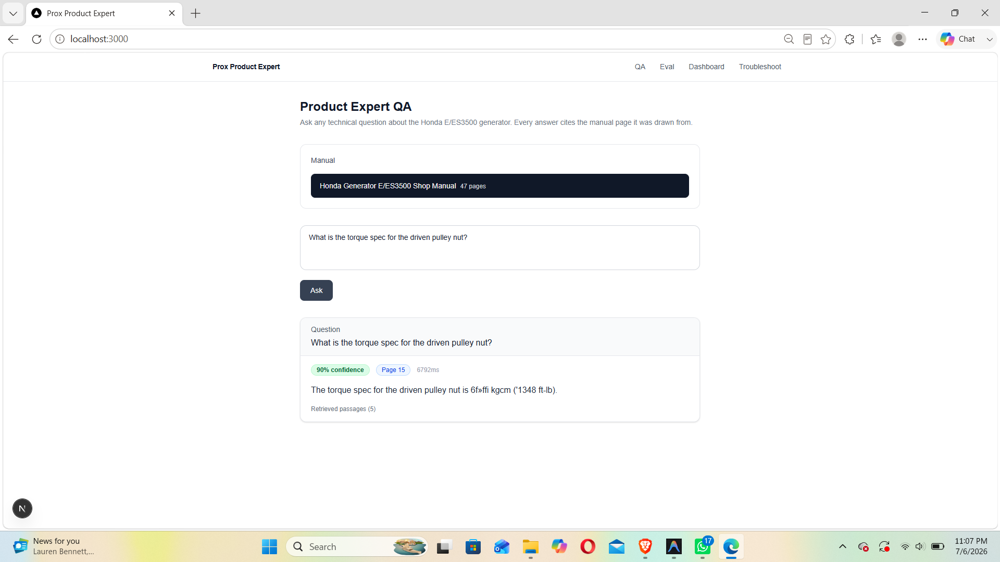
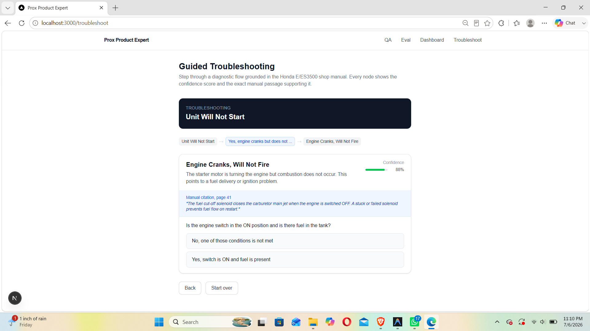
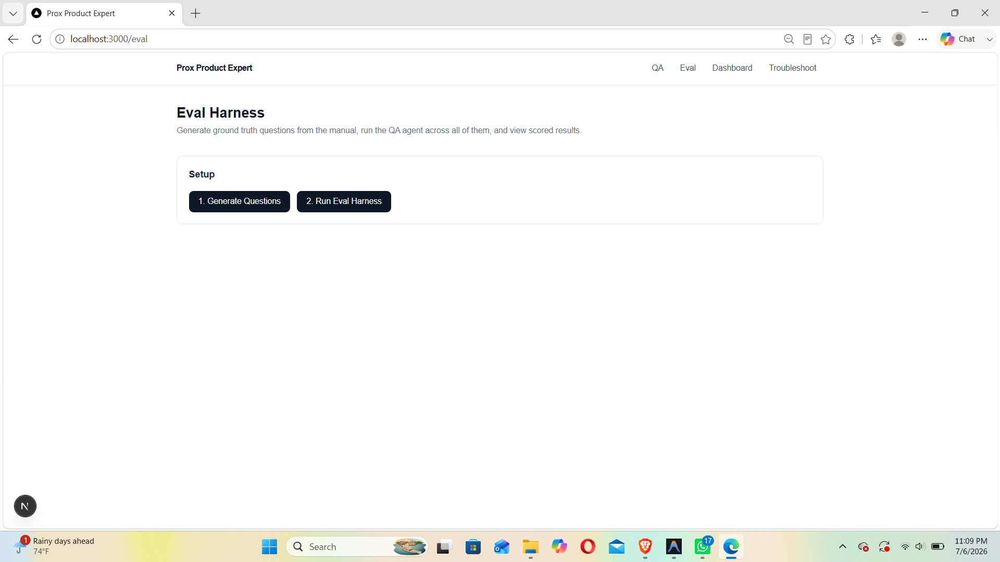
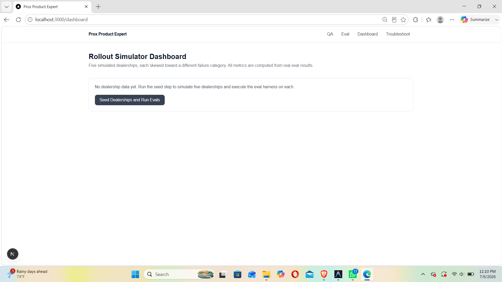

# Prox Grounded Product Expert

An AI-powered QA engine grounded in equipment shop manuals. Ask technical questions about equipment, get answers with confidence scores and exact manual page citations — no hallucinations, no guessing.

Built with **FastAPI + LangGraph** on the backend and **Next.js** on the frontend, using **OpenAI embeddings** and **SQLite** for vector storage.

---

## Features

| Feature | Description |
|---|---|
| **Product Expert QA** | Ask any technical question; the agent retrieves relevant manual chunks and returns a grounded answer with confidence score and page citation |
| **Guided Troubleshooting** | Step-by-step diagnostic decision tree grounded in manual pages — walks a technician through failure modes with confidence-weighted branches |
| **Eval Harness** | Auto-generates ground-truth questions from the manual, runs the QA agent over all of them, and scores on coverage, retrieval accuracy, citation accuracy, hallucination rate, and groundedness |
| **Rollout Simulator Dashboard** | Simulates five dealerships each skewed toward a different failure category; computes per-dealership metrics from real eval runs |

---

## Screenshots

### Product Expert QA
Ask technical questions and get grounded answers with confidence scores, page citations, and retrieved passage counts.



### Guided Troubleshooting
Walk through a diagnostic decision tree for failure modes like "Unit Will Not Start", with manual-grounded confidence scores at each branch.



### Eval Harness
Generate ground-truth questions from the manual, then run the eval harness to score the QA agent across all of them.



### Rollout Simulator Dashboard
Seed five simulated dealerships and run evals on each to compare performance across different failure categories.



---

## The PDF — Which Manual & How It's Used

### Which manual

The project ships pre-loaded with the **Honda Generator E/ES3500 Shop Manual** (47 pages). This is the manual visible in the QA screenshot and the one the troubleshooting decision tree is grounded in. Any PDF shop manual can be ingested in its place.

### How the PDF flows through the system

```
PDF file
   │
   ▼
PyMuPDF (fitz)
   │  Extracts raw text page-by-page
   │  Detects section headers (ALL-CAPS lines, numbered headings)
   │
   ▼
Chunker  (ingestion/pdf_parser.py)
   │  Splits each page into overlapping chunks
   │  chunk_size = 400 characters, overlap = 80 characters
   │  Each chunk stores: page_number, section_header, text, token_count
   │
   ▼
OpenAI text-embedding-3-small  (ingestion/embeddings.py)
   │  Embeds every chunk in batches of 100
   │  Returns float32 vectors
   │
   ▼
SQLite  (data/prox.db)
   │  Chunks + embeddings stored as BLOBs
   │  Tables: manuals, chunks (with embedding column)
   │
   ▼  ── at query time ──
   │
   ▼
Retrieval  (agent/retrieval.py)
   │  Embeds the user's question with the same model
   │  Computes cosine similarity against all stored chunk vectors
   │  Returns top-k most relevant chunks with their page numbers
   │
   ▼
LangGraph QA Agent  (agent/qa_agent.py)
   │  3-node graph: retrieve → generate → [escalate | END]
   │  GPT-4o receives the retrieved chunks as context
   │  Prompted to answer ONLY from provided passages — never from training data
   │  Returns: answer, confidence (0–1), cited_page, escalation_reason
   │
   ▼
Confidence check
   │  confidence ≥ 0.65  →  return grounded answer + page citation
   └  confidence < 0.65  →  escalate with reason + suggested next step
```

### Confidence calibration

| Score | Meaning |
|---|---|
| 0.90+ | Answer stated explicitly and completely in the retrieved passages |
| 0.70–0.89 | Answer clearly implied or reliably inferred |
| 0.50–0.69 | Answer requires interpretation or passages are incomplete |
| below 0.50 | Cannot be reliably determined — escalates automatically |

### Why overlapping chunks?

The 80-character overlap between consecutive chunks ensures that sentences split across chunk boundaries are still fully represented in at least one chunk, preventing the retriever from missing answers that straddle a split point.

---

## Project Structure

```
prox-challenge/
├── .env                        # Root env (OPENAI_API_KEY, DB_PATH, CONFIDENCE_THRESHOLD)
├── data/
│   └── prox.db                 # SQLite database (manuals, chunks, embeddings, eval results)
├── backend/
│   ├── main.py                 # FastAPI app entry point
│   ├── database.py             # SQLite connection + schema init
│   ├── models.py               # Pydantic models
│   ├── requirements.txt
│   ├── agent/
│   │   └── qa_agent.py         # LangGraph QA agent (retrieval + grounding + escalation)
│   ├── ingestion/
│   │   ├── pdf_parser.py       # PDF chunking via PyMuPDF
│   │   └── embeddings.py       # OpenAI text-embedding calls
│   ├── routers/
│   │   ├── ingest.py           # POST /ingest/path, POST /ingest/upload
│   │   ├── qa.py               # GET /qa/manuals, POST /qa/ask
│   │   ├── eval.py             # POST /eval/generate-questions, POST /eval/run, GET /eval/runs
│   │   └── dashboard.py        # POST /dashboard/seed, GET /dashboard/metrics, GET /dashboard/troubleshoot-flow
│   ├── eval/
│   │   ├── question_gen.py     # LLM-based question generation from manual chunks
│   │   ├── harness.py          # Runs QA agent over eval questions and scores results
│   │   └── scoring.py          # Scoring logic (retrieval, citation, hallucination, groundedness)
│   └── simulator/
│       └── dealerships.py      # Seeds 5 simulated dealerships and runs per-dealership evals
└── frontend/
    ├── .env.local              # NEXT_PUBLIC_API_URL=http://localhost:8001
    ├── app/
    │   ├── page.tsx            # QA page (/)
    │   ├── eval/page.tsx       # Eval Harness (/eval)
    │   ├── dashboard/page.tsx  # Rollout Simulator (/dashboard)
    │   └── troubleshoot/page.tsx # Guided Troubleshooting (/troubleshoot)
    └── components/             # Shared UI components
```

---

## Prerequisites

- **Python 3.11+**
- **Node.js 18+**
- **OpenAI API key** (already configured in `.env`)

---

## Setup & Running

### 1. Backend

```bash
cd backend

# Install dependencies
pip install -r requirements.txt

# Start the server on port 8001
uvicorn main:app --reload --port 8001
```

Verify: http://localhost:8001/health → `{"status": "ok"}`

Interactive API docs: http://localhost:8001/docs

> **Note:** `main.py` defaults to port 8000 in its docstring, but the frontend is configured for **port 8001**. Always start with `--port 8001`.

---

### 2. Frontend

```bash
cd frontend

# Install dependencies
npm install

# Start dev server
npm run dev
```

Open: http://localhost:3000

---

## Usage Walkthrough

### Step 1 — Ingest a Manual

Before you can ask questions, ingest a PDF shop manual via the API:

```bash
curl -X POST http://localhost:8001/ingest/path \
  -H "Content-Type: application/json" \
  -d '{"filepath": "/absolute/path/to/manual.pdf", "title": "Honda Generator E/ES3500", "equipment_type": "generator"}'
```

Or use the `/ingest/upload` endpoint to upload a file directly.

The backend will:
1. Parse the PDF into text chunks (PyMuPDF)
2. Generate OpenAI embeddings for each chunk
3. Store everything in `data/prox.db`

---

### Step 2 — Ask Questions (QA Page)

Navigate to http://localhost:3000

- Select a manual from the dropdown
- Type any technical question (e.g. *"What is the torque spec for the driven pulley nut?"*)
- The agent retrieves the top-k relevant chunks, grounds its answer, and returns:
  - **Answer** with explanation
  - **Confidence score** (0–100%)
  - **Page citation** from the manual
  - **Latency** in milliseconds
  - **Retrieved passage count**

If confidence falls below the threshold (`CONFIDENCE_THRESHOLD=0.65`), the agent escalates with a reason and suggested next step instead of guessing.

---

### Step 3 — Guided Troubleshooting

Navigate to http://localhost:3000/troubleshoot

Walk through an interactive diagnostic tree for **"Unit Will Not Start"**:

- Each node shows a question, confidence score, and the exact manual passage it is grounded in
- Select a branch to navigate deeper into the diagnosis
- Leaf nodes show the likely cause, next diagnostic step, and whether to escalate to a service center

---

### Step 4 — Run the Eval Harness

Navigate to http://localhost:3000/eval

**Generate Questions** (takes 1–3 minutes):
- Clicks `1. Generate Questions` → calls `POST /eval/generate-questions`
- The LLM reads manual chunks and generates ground-truth Q&A pairs

**Run Eval Harness** (takes several minutes for ~150 questions):
- Clicks `2. Run Eval Harness` → calls `POST /eval/run`
- The agent answers every generated question; each result is scored on:

| Metric | Description |
|---|---|
| **Coverage** | % of questions the agent attempted (vs. escalated) |
| **Retrieval Accuracy** | % of questions where the correct chunk was retrieved |
| **Citation Accuracy** | % of answers citing the correct manual page |
| **Hallucination Rate** | % of answers flagged as not grounded in retrieved text |
| **Avg Groundedness** | Mean groundedness score (0–1) across all answers |
| **Avg Confidence** | Mean agent confidence score |
| **Calibration Error** | How well confidence correlates with actual accuracy |
| **Avg Latency** | Mean response time in milliseconds |

Results are stored in `data/prox.db` and can be exported as JSON via `GET /eval/runs/{run_id}/export`.

---

### Step 5 — Rollout Simulator Dashboard

Navigate to http://localhost:3000/dashboard

Click **"Seed Dealerships and Run Evals"**:
- Seeds 5 simulated dealerships, each skewed toward a different failure category (fuel system, electrical, mechanical, etc.)
- Runs the full eval harness on each dealership's question set
- Displays per-dealership metrics side by side so you can compare how the agent performs across different failure distributions

---

## Environment Variables

| Variable | Location | Description |
|---|---|---|
| `OPENAI_API_KEY` | `.env` (root) | OpenAI API key for embeddings and LLM calls |
| `DB_PATH` | `.env` (root) | Path to the SQLite database (`../data/prox.db`) |
| `CONFIDENCE_THRESHOLD` | `.env` (root) | Minimum confidence before the agent escalates (default: `0.65`) |
| `NEXT_PUBLIC_API_URL` | `frontend/.env.local` | Backend base URL (`http://localhost:8001`) |

---

## API Reference

Full interactive docs are available at http://localhost:8001/docs once the backend is running.

| Method | Endpoint | Description |
|---|---|---|
| `GET` | `/health` | Health check |
| `POST` | `/ingest/path` | Ingest PDF from server file path |
| `POST` | `/ingest/upload` | Ingest PDF via file upload |
| `GET` | `/qa/manuals` | List all ingested manuals |
| `POST` | `/qa/ask` | Ask a question against a manual |
| `POST` | `/eval/generate-questions` | Generate ground-truth eval questions |
| `POST` | `/eval/run` | Run eval harness (synchronous) |
| `GET` | `/eval/runs` | List all eval runs |
| `GET` | `/eval/runs/{run_id}` | Get a single eval run summary |
| `GET` | `/eval/runs/{run_id}/results` | Per-question results for a run |
| `GET` | `/eval/runs/{run_id}/export` | Export full run as JSON |
| `POST` | `/dashboard/seed` | Seed 5 dealerships and run their evals |
| `GET` | `/dashboard/metrics` | Per-dealership metrics for the dashboard |
| `GET` | `/dashboard/troubleshoot-flow` | Decision tree for "Unit Will Not Start" |

---

## Tech Stack

| Layer | Technology |
|---|---|
| Frontend | Next.js 16, React 19, TypeScript |
| Backend | FastAPI, Uvicorn |
| AI Agent | LangGraph, OpenAI GPT + embeddings |
| PDF Parsing | PyMuPDF |
| Database | SQLite (via `database.py`) |
| Eval | Custom harness with LLM-based scoring |
